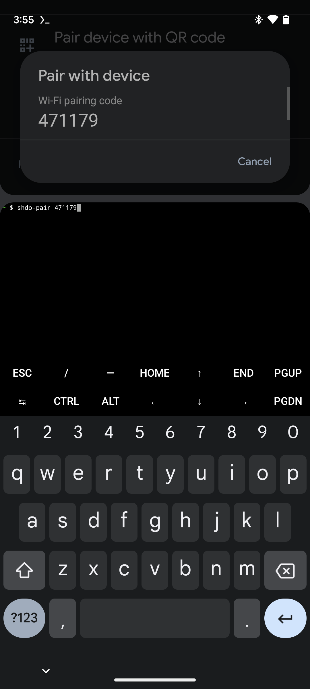
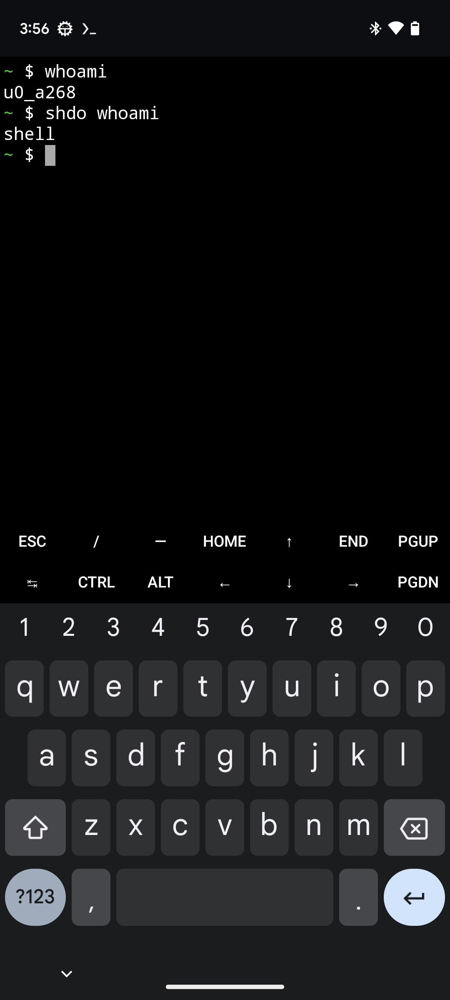

# shdo

shdo is a tool to escalate privilege (like sudo) for Android that don't need any computer to be installed.

## Features

- Fast pairing with **shdo-pair**
- Fast command execution with **shdo**
- Bruteforce all ports needed for pairing or execution
- Automatically move scripts or executables to permissive folders

## How to Install

To install the tool first you will need the **Termux** application. Because the Termux app is not updated anymore on the Play Store you will need to download it from an alternative store: [F-Droid](https://f-droid.org/fr/packages/com.termux/).

After installing Termux we will use it to install three things: the Android Debug Bridge (ADB), Python 3 and Shdo.

To install **ADB** just run the command to install the packages:
> apt-get install android-tools

Then you will need **Python 3** to run the shdo tool. You can simply install it with the following command:
> apt-get install python

When Python 3 is installed you can install **shdo** by running:
> pip install shdo

## How to Use

First you need to pair shdo with your ADB daemon. To do that you can use the **shdo-pair** command with your pairing code.
And to get your pairing code just go into the Developer Settings then into Wireless Debugging and hit **Pair device with pairing code**.
> shdo-pair PAIRING_CODE

The only problem is that the code disapear everytime you leave the Settings app. To bypass this problem we can use **Applications Split-Screening** to keep our Settings app alive, and enter the code in the other Termux window.

When the pairing is done you can run as much command as you want with **shell** privileges using shdo direclty:
> shdo COMMAND

If you don't want to do the pairing every few days/weeks you can disable the **adb authorization timeout** in the Developer Settings. That way your pairing will also still works after reboots.

## Credits

- [Mathias Bochet](https://www.linkedin.com/in/mathias-bochet/) (aka Zen)